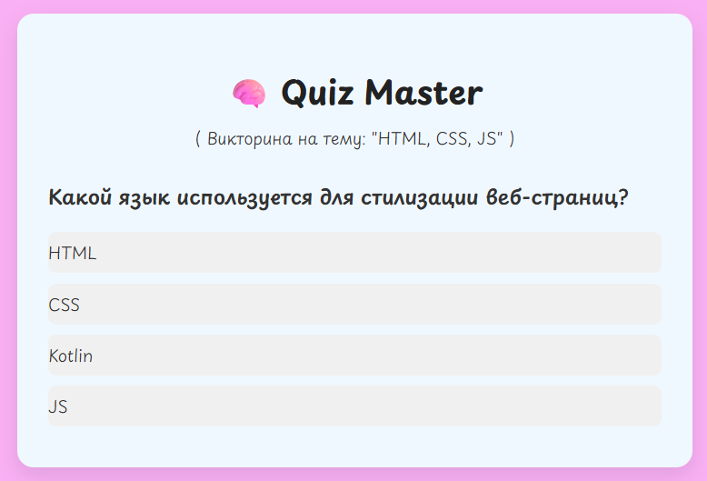

# Quiz Master

**Quiz Master** - это миги-приложение-викторина, в котором пользователь отвечает на вопросы по HTML, CSS и JavaScript. По завершении показывается результат и баллы.

## Стек Технологий 

- React
- JSX + useState
- Css
- Google Fonts

## Возможности

- Отображение одного вопроса с вариантами
- Проврека правильного ответа
- Подсчет баллов
- Финальный экран результатов
- Кнопка "Пройти заново"

## Запуск проекта

1. Клонировать репозиторий:
```bash
git clone https://github.com/Viktorikata/Quiz-Master.git
```

2. Перейти в папку проекта
```bash
cd Quiz-Master
```

3. Установить зависимости: 
```bash
npm install
```

4. Запустить проект 
```bash
npm start
```

 ---

 ## Автор

 [Виктория (Viktorikata)](https://github.com/Viktorikata)


